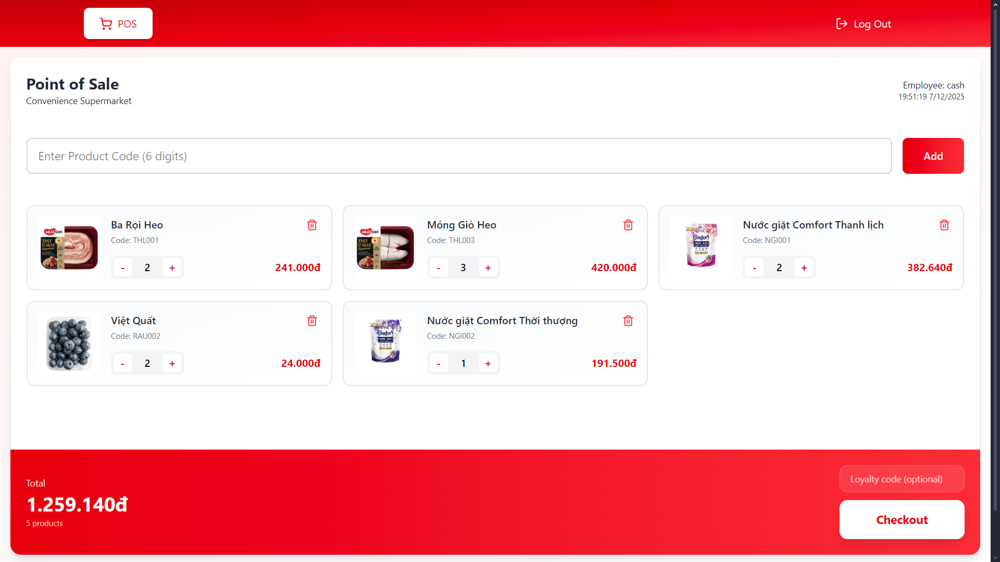
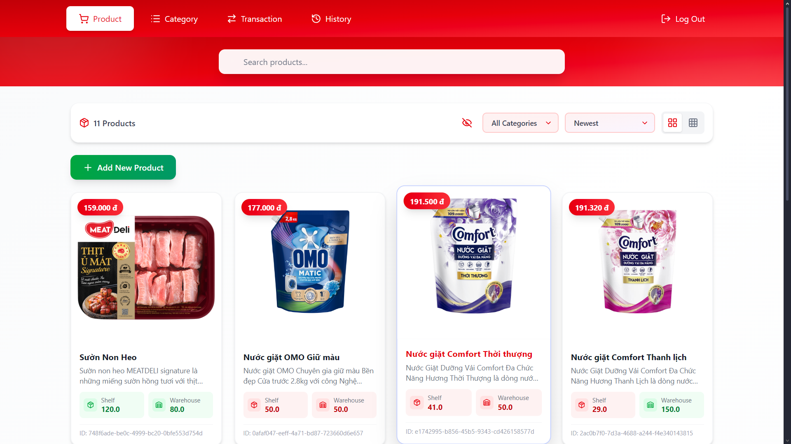
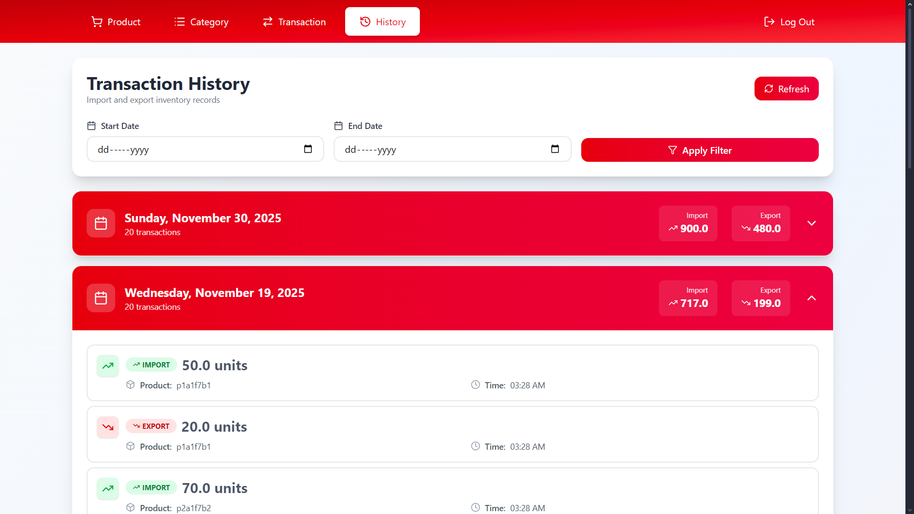
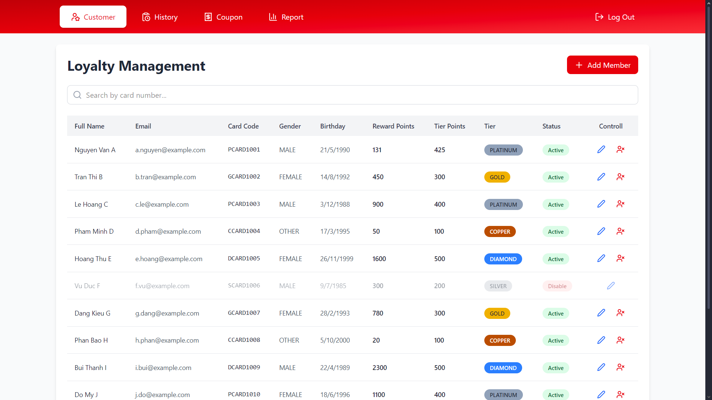
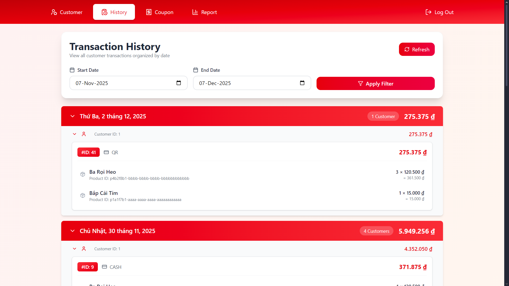
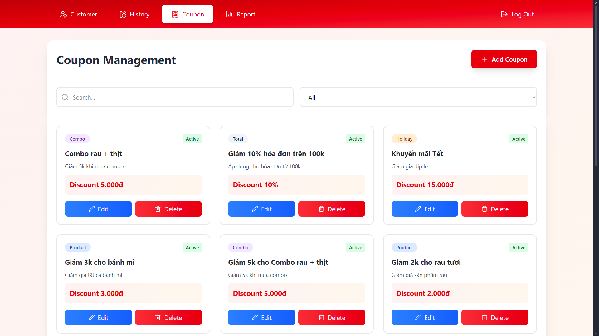
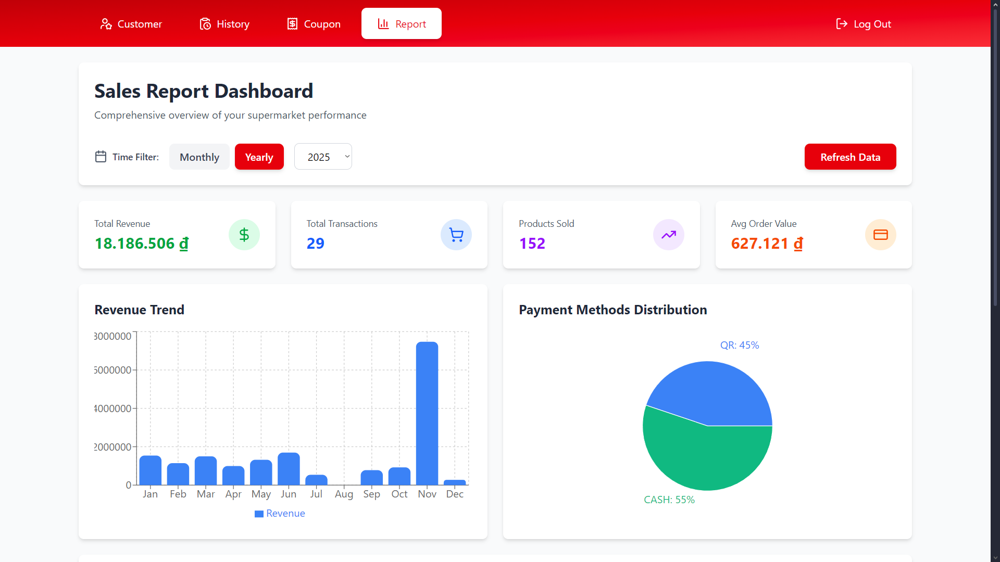
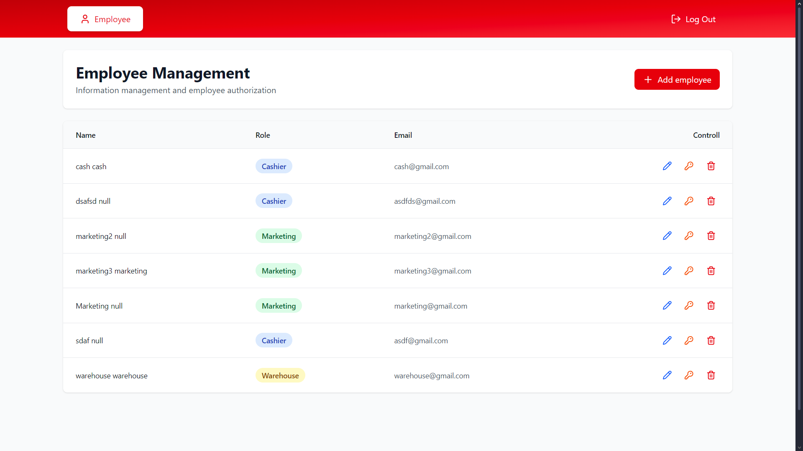

# Supermarket Management System

A microservices-based supermarket management platform with role-based access control and real-time transaction processing.

## Technology Stack

### Backend

- **Java 21** with **Spring Boot 3.5.x**
- **Spring Cloud Gateway** (API Gateway)
- **Spring Security** with OAuth2/JWT (Keycloak)
- **Spring Data JPA** with MySQL
- **MinIO** for file storage
- **Docker** containerization

### Frontend

- **React 19** with **Vite**
- **Tailwind CSS** for styling
- **React Router** for navigation
- **Axios** for HTTP requests
- **Recharts** for analytics

## Core Features

- **Product Management** - Catalog, categories, inventory tracking
- **Inventory Management** - Real-time stock monitoring, auditing
- **Employee Management** - Profiles, roles, permissions
- **Customer Management** - Profiles, loyalty tracking, history
- **Transaction Processing** - POS checkout, payments, refunds
- **Coupon & Marketing** - Promotions, discounts, campaigns
- **Role-Based Access** - CASHIER, WAREHOUSE, ADMIN, MARKETING roles

## Services

| Service | Port | Role |
|---------|------|------|
| API Gateway | 9000 | Central routing & OAuth2 validation |
| Product Service | 8080 | Product & category management |
| Employee Service | - | Employee records & roles |
| Customer Service | - | Customer profiles & loyalty |
| Coupon Service | - | Promotions & discounts |
| Inventory Service | - | Stock tracking & auditing |
| Transaction Service | - | POS & payment processing |
| Keycloak | 8888 | Identity & authentication |

## Architecture

- **Microservices** - Independent services with separate databases
- **API Gateway** - Single entry point for all requests
- **MySQL** - Persistent data storage
- **MinIO** - Object storage for files
- **Docker** - Containerized deployment

## Security

- OAuth2 authentication via Keycloak
- JWT token-based authorization
- Role-based access control (RBAC)
- Secure API Gateway validation

## Environment Setup

Set environment variables before running:
- `DATASOURCE_URL` - MySQL connection
- `DATASOURCE_USERNAME` - DB user
- `DATASOURCE_PASSWORD` - DB password
- `OAUTH2_ISSUER_URI` - Keycloak issuer
- `OAUTH2_JWK_SET_URI` - JWT validation endpoint
- `FRONTEND_URL` - Frontend application URL

## Preview of this website:

- Point of Sale

  

- Product Management

  

- Warehouse Transaction History

  

- Loyaty Customer Management

  

- Customer Transaction History

  

- Coupon Management

  

- Sales Report Dashboard

  

- Employe Management

  

